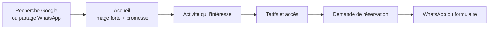

# Brief — Site touristique d'Ebogo (Cameroun)

2026-09-23

## Le projet

Un site vitrine bilingue (FR/EN) pour le site écotouristique d'Ebogo, sur le fleuve Nyong au Cameroun, qui doit permettre à un visiteur de comprendre en moins d'une minute ce qu'on y fait, ce que ça coûte, comment y aller, et de réserver.

Critère de réussite : un voyageur arrivé par une recherche Google repart avec une date, un tarif et un contact — pas seulement une jolie page.

À trancher avant de coder :

- Qui porte le site (communauté du village, commune de Mengueme, opérateur privé, association) ? Cela change le ton et la page « À propos ».
- Réservation réelle (paiement en ligne, Mobile Money) ou simple demande (WhatsApp + formulaire) ? **Recommandation : demande simple en v1**, paiement plus tard.

## Ce qu'il y a à Ebogo

Village de la commune de Mengueme, département du Nyong-et-So'o, région du Centre : à environ 18 km de Mbalmayo et 1 h 30 de route de Yaoundé. Le site est aménagé depuis 1996 par l'État et l'Organisation mondiale du tourisme et reçoit de l'ordre de 3 000 visiteurs par an ([Cameroon Tribune](https://www.cameroon-tribune.cm/article.html/39476/fr.html/site-debogo-le-charme-de)).

Le fleuve et la forêt sont l'attrait central. Activités relevées dans les sources publiques :

| Activité | Notes |
| --- | --- |
| Excursion en pirogue sur le Nyong | Produit phare ; sous-bois inondés praticables surtout en saison des pluies |
| Arbre géant (le « Kossipo ») | Diamètre annoncé de 8 à 12 m selon les sources — à mesurer/trancher |
| Sentier botanique | Randonnée pédestre en forêt |
| Île aux perroquets, embouchure du So'o | Étapes en pirogue |
| Pêche traditionnelle et sportive | |
| Observation des oiseaux, papillons, grotte aux roussettes | |
| Restaurant sur pilotis | Poisson d'eau douce, poulet ; réservation des repas conseillée |

Un second arbre géant, l'« atui », documenté en 2025, serait plus grand que le Kossipo et porte un récit de village transmis oralement ([Mongabay](https://fr.mongabay.com/2025/08/cameroun-un-nouvel-geant-arbre-decouvert-plus-grand-que-le-celebre-kosipo-attire-les-touristes/)). C'est un angle éditorial fort, à condition d'avoir l'accord de la communauté sur ce qui peut être raconté.

Les tarifs publiés en ligne sont contradictoires (10 000 à 50 000 FCFA selon les sources et les années). **Aucun prix ne doit être écrit en dur dans le code** : tout passe par un fichier de contenu, avec une date de mise à jour visible.

## Publics et parcours

Quatre publics, par ordre de priorité pour la v1 :

1. **Voyageur international / expatrié à Yaoundé** — cherche une excursion à la journée. Il a besoin de : quoi faire, durée, prix, route, réserver.
2. **Diaspora camerounaise** — voyage au pays, veut emmener famille et enfants. Sensible au récit, aux photos, à la fiabilité du contact.
3. **Groupes scolaires et universitaires** — sentier botanique, biodiversité. Besoin d'une offre groupe et d'un devis.
4. **Tour-opérateurs et agences** — cherchent une fiche claire, des tarifs et un interlocuteur.

Parcours cible (à respecter dans la conception) :

Le bouton de réservation doit rester visible à tout moment sur mobile (barre fixe en bas).

## Arborescence

Six pages, pas plus, en v1.

| Page | Route | Contenu |
| --- | --- | --- |
| Accueil | `/` | Image plein écran du Nyong + promesse en une phrase ; 3 activités phares ; comment venir ; témoignages ; appel à réserver |
| Activités | `/activites` | Une carte par activité (pirogue, arbre géant, sentier botanique, pêche, oiseaux/papillons), durée, saison, niveau, prix indicatif |
| Fiche activité | `/activites/[slug]` | Récit, galerie, ce qui est inclus, ce qu'il faut prévoir, bouton réserver |
| Préparer sa visite | `/infos` | Accès depuis Yaoundé et Mbalmayo, saisons, quoi emporter, restauration, hébergement, questions fréquentes |
| Le village | `/village` | Histoire d'Ebogo, la communauté, engagement écotouristique, respect du site |
| Réserver | `/reserver` | Formulaire (date, nombre de personnes, activité, langue) + bouton WhatsApp direct |

Éléments transverses : sélecteur FR/EN, carte de localisation, pied de page avec contacts et réseaux, page 404 soignée.

## Direction artistique

Le ton visé : calme, forêt, eau lente — pas le template « agence de voyage » avec bandeaux bleus et badges promo. La photo porte le site ; l'interface s'efface.

**Palette** (tokens à définir une fois, jamais de couleur en dur dans les composants)

| Rôle | Couleur | Usage |
| --- | --- | --- |
| Fond | Blanc cassé chaud `#FAF7F2` | Toutes les pages |
| Texte | Vert-noir profond `#12211B` | Titres et corps |
| Primaire | Vert forêt `#1F4D3A` | Boutons, liens, navigation |
| Accent | Terre de latérite `#B4562A` | Un seul élément par écran maximum |
| Eau | Vert-eau désaturé `#6E8F82` | Séparateurs, fonds de section |

**Typographie** : une serif à fort caractère pour les titres (Fraunces ou Playfair Display), une sans-serif neutre et très lisible pour le corps (Inter ou Source Sans). Deux familles, pas trois.

**Règles de mise en page**

- Grande photo pleine largeur en tête de chaque page, avec un titre posé dessus — jamais de carrousel automatique.
- Beaucoup d'air : espacements généreux, texte en colonne de 65 à 75 caractères.
- Coins légèrement arrondis (8 px), ombres très douces ou pas d'ombre du tout.
- Animations discrètes : apparition au défilement, pas de parallaxe agressif.
- Pas d'icônes génériques d'avion ou de valise ; si des pictos sont nécessaires, un seul jeu cohérent (Lucide), trait fin.

**À éviter explicitement** : dégradés violet-bleu, cartes flottantes empilées, emojis dans les titres, texte blanc sur photo sans voile de contraste.

## Stack et contraintes

- **Next.js (App Router) + TypeScript + Tailwind CSS + shadcn/ui**, contenu en fichiers MDX ou JSON versionnés — pas de CMS en v1.
- **Bilingue FR/EN** dès le départ via `next-intl` : routes `/fr` et `/en`, aucun texte écrit en dur dans les composants.
- **Mobile-first et connexion lente.** C'est la contrainte majeure : une grande partie du public consultera le site en 3G depuis le Cameroun. Objectif : moins de 1 Mo au premier chargement, images en WebP/AVIF servies par `next/image`, polices en `display: swap`, aucune bibliothèque d'animation lourde.
- **Réservation v1** : formulaire → envoi d'e-mail (Resend) + bouton WhatsApp avec message pré-rempli. Pas de paiement en ligne.
- **SEO** : métadonnées par page, `sitemap.xml`, données structurées `TouristAttraction` (Schema.org), pages pensées pour les recherches « que faire près de Yaoundé », « Ebogo pirogue Nyong ».
- **Accessibilité** : contraste AA, navigation au clavier, textes alternatifs sur toutes les photos, pas d'information portée uniquement par la couleur.
- **Hébergement** : Vercel, gratuit pour démarrer ; nom de domaine `.cm` ou `.com` à acheter séparément.
- **Analytique** : Plausible ou Vercel Analytics, sans bandeau cookies intrusif.

## Ce qu'il faut réunir

Le code peut démarrer sans, avec des placeholders. Le site ne peut pas être publié sans.

- [ ] 15 à 25 photos en haute définition : pirogue sur le Nyong, l'arbre géant avec une personne à l'échelle, le sentier, le restaurant sur pilotis, des visages (avec accord des personnes)
- [ ] Tarifs à jour, par activité et par personne ou par pirogue, avec la date de validité
- [ ] Numéro WhatsApp et e-mail de réservation, et qui répond réellement
- [ ] Horaires d'ouverture et saisons recommandées
- [ ] Itinéraire exact depuis Yaoundé et depuis Mbalmayo, état de la piste
- [ ] Options d'hébergement sur place ou à proximité
- [ ] Accord de la communauté sur ce qui peut être raconté et photographié, notamment autour de l'arbre sacré
- [ ] 3 à 5 témoignages de visiteurs

**Sources consultées**

- [Cameroon Tribune — Site d'Ebogo](https://www.cameroon-tribune.cm/article.html/39476/fr.html/site-debogo-le-charme-de)
- [Mongabay — un nouvel arbre géant à Ebogo (2025)](https://fr.mongabay.com/2025/08/cameroun-un-nouvel-geant-arbre-decouvert-plus-grand-que-le-celebre-kosipo-attire-les-touristes/)
- [Made in Cameroun — Site touristique d'Ebogo](https://madeincameroun.org/tourisme/site-touristique-debogo/)

Informations relevées en ligne et non vérifiées sur place : à confirmer avant publication.

## Contenu déjà disponible (V1 du site, oct. 2025)

Le premier site (statique, archivé dans `legacy-static-site/`) contenait déjà une grille tarifaire complète fournie directement par l'exploitant du site (document « EBOGO ECOTOURISTIC CENTRE SCHEDULE OF SERVICES »), 18 photos réelles d'Ebogo, et les coordonnées de contact suivantes :

- WhatsApp : +237 677 37 96 97
- Email : sitetouristiquedebogo1@gmail.com
- Lieu : Ebogo, Commune de Mengueme, Région du Centre, Cameroun

Ces éléments sont réutilisés comme contenu de départ (plus fiables que les tarifs contradictoires trouvés en ligne), avec leur date de mise à jour d'origine indiquée. Ils restent à reconfirmer avant republication, comme demandé ci-dessus.
